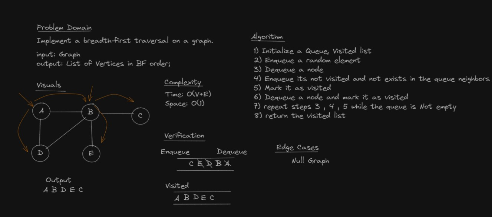
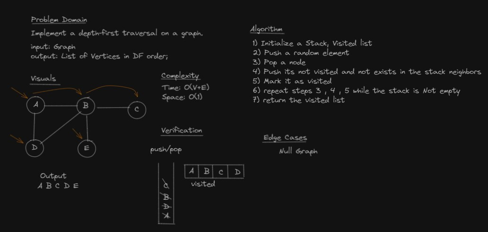

# Graphs
A graph is a non-linear data structure that can be looked at as a collection of Vertices (= Nodes)

- Undirected Graphs
    - An Undirected Graph is a graph where each edge is undirected or bi-directional.
- Directed Graphs
    - Each node is directed at another node with a specific edge.
Weighted Graphs
A weighted graph is a graph with numbers assigned to its edges. These numbers are called weights.

## Graph Representation

- Adjacency Matrix
    - An Adjacency matrix is represented through a 2-dimensional array. If there are n vertices, then we are looking at an n x n matrix
- Adjacency List
    - An adjacency list is a collection of linked lists or array that lists all of the other vertices that are connected.

## Traversals
- Breadth-First
- Depth-First## Challenge

## Challenge
Implement Graph. The graph should be represented as an adjacency list, and should include the following methods:

- add node
    - Arguments: value
    - Returns: The added node
    - Add a node to the graph

- add edge
    - Arguments: 2 nodes to be connected by the edge, weight (optional)
    - Returns: nothing
    - Adds a new edge between two nodes in the graph
    - If specified, assign a weight to the edge
    - Both nodes should already be in the Graph

- get nodes
    - Arguments: none
    - Returns all of the nodes in the graph as a collection (set, list, or similar)

- get neighbors
    - Arguments: node
    - Returns a collection of edges connected to the given node
    - Include the weight of the connection in the returned collection

- size
    - Arguments: none
    - Returns the total number of nodes in the graph

- Breadth First
    - Arguments: Node
    - Return: A collection of nodes in the order they were visited.

    

- Depth First
    - Arguments: Node
    - Return: A collection of nodes in the order they were visited.

    

## Solution

```c#
public class Graph
    {
        private List<Vertex> _list { get; set; }
        
        public Graph(){
            _list = new List<Vertex>();
        }

        public Vertex Add(Vertex value)
        {
            //Vertex vertex = new Vertex(value);

            if (_list.Contains(value))
            {
                throw new Exception("Vertex Is Exists Before!");
            }
            else
            {
                _list.Add(value);
            }

            return value;
        }

        public void AddEdge(Vertex from, Vertex to)
        {
            Vertex from_vertex = null, to_vertex = null;

            foreach (var v in _list)
            {
                if (v == from)
                    from_vertex = v;
                if (v == to)
                    to_vertex = v;
            }

            if (from_vertex == null)
                throw new Exception("The 'FROM' Vertex is not exist");

            if (to_vertex == null)
                throw new Exception("The 'TO' Vertex is not exist");

            from_vertex.Neighbors.Add(to_vertex);

            to_vertex.Neighbors.Add(from_vertex);
        }

        public List<Vertex> GetVertices()
        {
            return _list;
        }

        public int Size()
        {
            return _list.Count();
        }

        public List<Vertex> GetNeighbours(Vertex vertex)
        {
            foreach (var node in _list)
            {
                if(node == vertex)
                {
                    return node.Neighbors;
                }
            }

            throw new Exception("Vertex Does NOT Exist!");
        }

        public List<Vertex> BreadthFirst()
        {
            Queue<Vertex> queue = new Queue<Vertex>();
            List<Vertex> visited = new List<Vertex>();

            // enqueue a random node
            queue.Enqueue(_list[0]);

            while(queue.Count != 0)
            {
                Vertex vertex = queue.Dequeue();
                foreach (Vertex v in vertex.Neighbors)
                {
                    if (!queue.Contains(v) && !visited.Contains(v))
                        queue.Enqueue(v);
                }

                visited.Add(vertex);
            }

            return visited;
        }

        public List<Vertex> DepthFirst()
        {
            Stack<Vertex> stack = new Stack<Vertex>();
            List<Vertex> visited = new List<Vertex>();

            // Push a random node
            stack.Push(_list[0]);

            while (stack.Count != 0)
            {
                Vertex vertex = stack.Pop();
                foreach (Vertex v in vertex.Neighbors)
                {
                    if (!stack.Contains(v) && !visited.Contains(v))
                        stack.Push(v);
                }

                visited.Add(vertex);
            }

            return visited;
        }
    }
```
