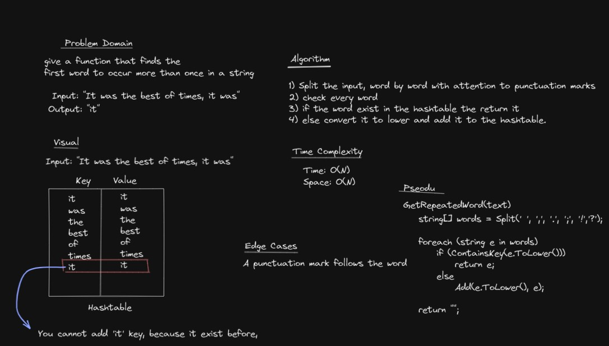

# Challenge Summary
Write a function called repeated word that finds the first word to occur more than once in a string
- Arguments: string
- Return: string

## Whiteboard Process


## Approach & Efficiency

1. Split the input, word by word with attention to punctuation marks 
2. check every word 
3. if the word exist in the hashtable the return it
4. else convert it to lower and add it to the hashtable.

- Time: O(N)
- Space: O(N)

## Solution

```
GetRepeatedWord(text)
    string[] words = Split(' ', ',', '.', ';', '!','?');
    foreach (string e in words)
        if (ContainsKey(e.ToLower()))
            return e;
        else
            Add(e.ToLower(), e);
    return "";
```
