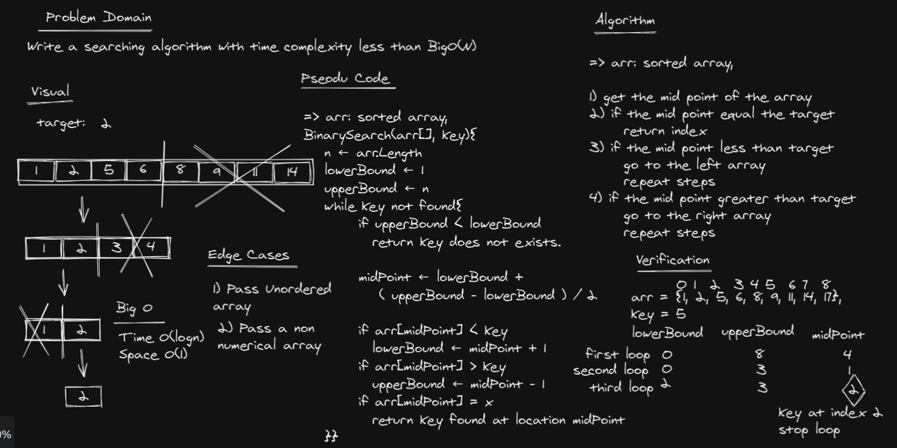

# Binary Search of Sorted Array

**Binary Search** is a searching algorithm used in a *sorted array by repeatedly dividing the search interval in half. 

## Whiteboard Process


## Approach & Efficiency

The algorithm follows the ***Divide & Conquer*** approach.

Complexity: Big O( log n )

## Code

### Iterative Solution

```c#
int BiSearch(double[] arr, double key)
        {
            int lowerBound = 0;
            int upperBound = arr.Length - 1;
            int midPoint;

            while (upperBound >= lowerBound)
            {
                midPoint = lowerBound + (upperBound - lowerBound) / 2;

                if (arr[midPoint] < key)
                    lowerBound = midPoint + 1;

                if (arr[midPoint] > key)
                    upperBound = midPoint - 1;

                if (arr[midPoint] == key)
                    return midPoint;
            }

            return -1;
        }
```

### Recursive Solution

```c#
int BiSearch(double[] A, int lowerBound, int upperBound, double x)
        {
            if (lowerBound > upperBound)
                return -1;

            int mid = (lowerBound + upperBound) / 2;

            if (x == A[mid])
                return mid;

            else if (x < A[mid])
                return BiSearch(A, lowerBound, mid - 1, x);

            else
                return BiSearch(A, mid + 1, upperBound, x);
        }
```