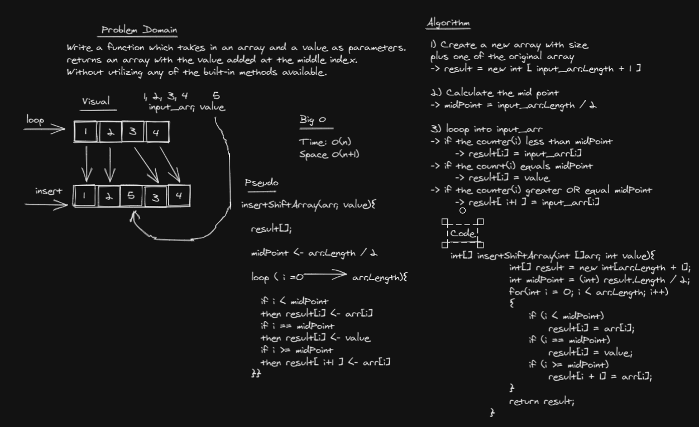

# Insert to Middle of an Array
```insertShiftArray``` which takes in an array and a value as parameters.
returns an array with the value added at the middle index. Without utilizing any of the built-in methods available.

## Whiteboard Process


```c#
int[] insertShiftArray(int []arr, int value){
            
            int[] result = new int[arr.Length + 1];

            int midPoint = (int) result.Length / 2;
            
            for(int i = 0; i < arr.Length; i++)
            {
                if (i < midPoint)
                    result[i] = arr[i];

                if (i == midPoint)
                    result[i] = value;

                if (i >= midPoint)
                    result[i + 1] = arr[i];
            }

            return result;
        }
```

## Approach & Efficiency
looping throgh the input array and insert data to a new array,
if you reach the mid point then insert your value, and continue inserting.

Time is O(n)
Space is O(n)