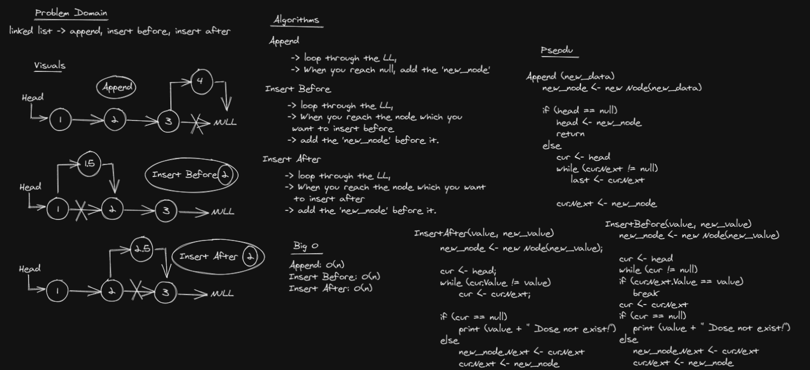

# Challenge Summary
Write the following methods for the Linked List class:

### append
arguments: new value
adds a new node with the given value to the end of the list

### insert before
arguments: value, new value
adds a new node with the given new value immediately before the first node that has the value specified

### insert after
arguments: value, new value
adds a new node with the given new value immediately after the first node that has the value specified

## Whiteboard Process


## Approach & Efficiency

Append -> O(n)
insert before -> O(n)
insert after -> O(n)

## Solution

```c#
public class LinkedListInsertion
    {
        public Node head;

        public void Append(string new_data)
        {
            Node new_node = new Node(new_data);

            if (head == null)
            {
                head = new Node(new_data);
                return;
            }

            new_node.Next = null;

            Node last = head;
            while (last.Next != null)
                last = last.Next;

            last.Next = new_node;
        }


        public void InsertAfter(string value, string new_value)
        {
            Node new_node = new Node(new_value);

            Node cur = head;
            while (cur.Value != value)
                cur = cur.Next;

            if (cur == null)
            {
                Console.WriteLine(value + " Dose not exist!");
            }
            else
            {
                new_node.Next = cur.Next;
                cur.Next = new_node;
            }
        }

        public void InsertBefore(string value, string new_value)
        {
            Node new_node = new Node(new_value);

            if(head.Value == value)
            {
                new_node.Next = head;
                head = new_node;
                return;
            }            

            Node cur = head;
            while (cur != null)
            {
                if (cur.Next.Value == value)
                    break;

                cur = cur.Next;
            }


            if (cur == null)
            {
                Console.WriteLine(value + " Dose not exist!");
            }
            else
            {
                new_node.Next = cur.Next;
                cur.Next = new_node;
            }
        }

        public string ToString()
        {
            string result = "";

            if (head == null)
            {
                return "The List is Empty!";
            }
            else
            {
                Node cur = head;
                while (cur != null)
                {
                    result += "[" + cur.Value + "] -> ";
                    cur = cur.Next;
                }
            }

            result += "NULL";

            return result;
        }

    }
```
