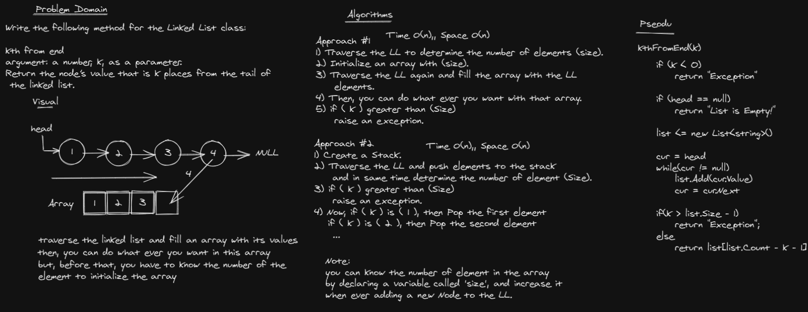

# Challenge Summary
Write the following method for the Linked List class:

```kthFromEnd```
**argument**: a number, k, as a parameter.
**Return** the node’s value that is k places from the tail of
 the linked list.

## Whiteboard Process


## Approach & Efficiency

Approach #1 Time O(n),, Space O(n)
1) Traverse the LL to determine the number of elements (size).
2) Initialize an array with (size).
3) Traverse the LL again and fill the array with the LL 
    elements.
4) Then, you can do what ever you want with that array. 
5) if ( k ) greater than (Size)
    raise an exception.

Approach #2 Time O(n),, Space O(n)
1) Create a Stack.
2) Traverse the LL and push elements to the stack
    and in same time determine the number of element (Size).
3) if ( k ) greater than (Size)
    raise an exception.
4) Now, if ( k ) is ( 1 ), then Pop the first element
   if ( k ) is ( 2 ), then Pop the second element
    ...

Note:
1) you can know the number of element in the array 
by declaring a variable called 'size', and increase it
when ever adding a new Node to the LL.

2) Use Generic array


## Solution
```c#
public class LinkedList_kth : LinkedListInsertion
    {
        public string kthFromEnd(int k)
        {
            if (k < 0)
                return "Exception";

            if (head == null)
                return "List is Empty!";

            List<string> list = new List<string>();

            Node cur = head;
            while(cur != null)
            {
                list.Add(cur.Value);
                cur = cur.Next;
            }

            if(k > list.Count - 1)
                return "Exception";
            else
                return list[list.Count - k - 1];
        }
    }
```
