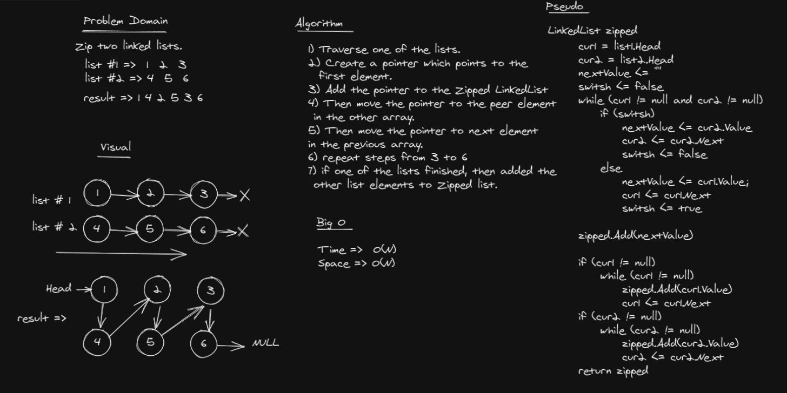

# Challenge Summary
Zip two linked lists.

list1 =>
[1] -> [3] -> [2] -> null

list2 =>
[5] -> [9] -> [4] -> null

Output =>
[1] -> [5] -> [3] -> [9] -> [2] -> [4] -> null

## Whiteboard Process


## Approach & Efficiency
The same approach used in 'Merginig', in Merge Sort.

Big ***O(n)***

## Solution

```c#
public static LinkedList Zip(LinkedList list1, LinkedList list2)
        {
            LinkedList zipped = new LinkedList();

            Node cur1 = list1.Head;
            Node cur2 = list2.Head;

            // store which value will be added to zipped LL
            string nextValue;

            bool switsh = false;

            // merge the LLs, like 'Merge Sort'
            while (cur1 != null && cur2 != null)
            {
                if (switsh)
                {
                    nextValue = cur2.Value;
                    cur2 = cur2.Next;
                    switsh = false;
                }
                else
                {
                    nextValue = cur1.Value;
                    cur1 = cur1.Next;
                    switsh = true;
                }

                zipped.Append(nextValue);
            }

            if (cur1 != null)
            {
                while (cur1 != null)
                {
                    zipped.Append(cur1.Value);
                    cur1 = cur1.Next;
                }
            }

            if (cur2 != null)
            {
                while (cur2 != null)
                {
                    zipped.Append(cur2.Value);
                    cur2 = cur2.Next;
                }
            }

            return zipped;
        }
```
