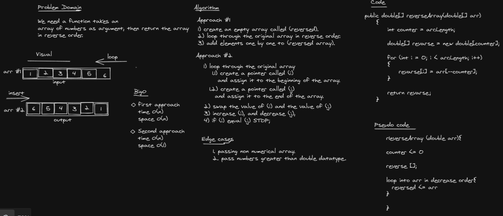

# Ravarse Array

The ```RevarseArray``` function takes an array as an argument. return an array with elements in reversed order.

## Whiteboard Process


```c#
public double[] reverseArray(double[] arr)
    {
        int counter = arr.Length;
    
        double[] revarse = new double[counter];
        
        for (int i = 0; i < arr.Length; i++)
        {
            revarse[i] = arr[--counter];
        }
    
        return revarse;
    }
```

## Approach & Efficiency
1. create an empty array called (reversed).
2. loop through the original array in reverse order.
3. add elements one by one to (reversed array).
