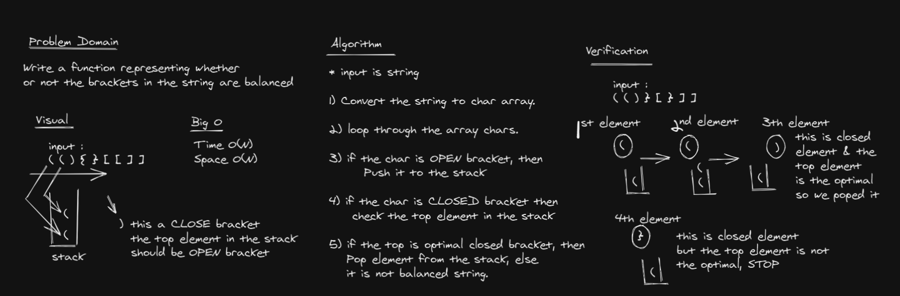
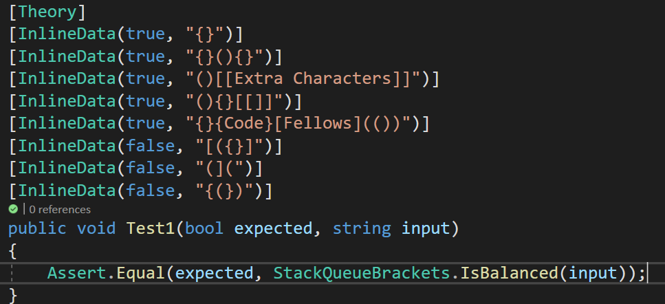

# Challenge Summary
Write a function representing whether
or not the brackets in the string are balanced

## Whiteboard Process


## Solution
```c#
IsBalanced(string text)
        {
            char[] splited = text.ToCharArray();

            Stack<char> stack1 = new Stack<char>();

            foreach (char c in splited)
            {
                if (c == '{' || c == '(' || c == '[')
                {
                    stack1.Push(c);
                    continue;
                }

                char top = stack1.Peek();

                switch (c)
                {
                    case '}':
                        if (top == '{')
                            stack1.Pop();
                        else
                            return false;
                        break;

                    case ')':
                        if (top == '(')
                            stack1.Pop();
                        else
                            return false;
                        break;

                    case ']':
                        if (top == '[')
                            stack1.Pop();
                        else
                            return false;
                        break;
                }
            }

            return true;
        }
```

## Examples
