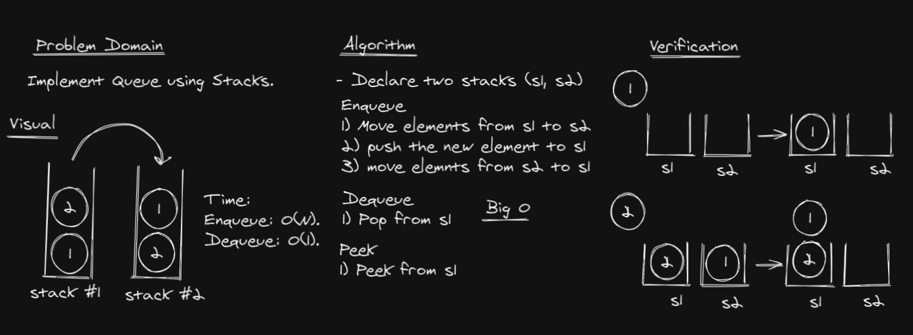

# Challenge Summary
Implement a Queue using two Stacks.

## Whiteboard Process


## Approach & Efficiency

**Enqueue(data)** ***O(n)***

While stack1 is not empty, push everything from stack1 to stack2.
Push data to stack1 (assuming size of stacks is unlimited).
Push everything back to stack1.

**Dequeue()** ***O(1)***

Pop an item from stack1

**Peek()** ***O(1)***

Peek an item from stack1

## Solution

```c#
public class PseudoQueue
    {
		public Stack s1 = new Stack();
		public Stack s2 = new Stack();

		public void Enqueue(int x)
		{
			// Move all elements from s1 to s2
			while (s1.Count > 0)
				s2.Push(s1.Pop());

			// Push item into s1
			s1.Push(x);

			// Push everything back to s1
			while (s2.Count > 0)
				s1.Push(s2.Pop());
		}

		public void Dequeue()
		{
			if (s1.Count == 0)
				Console.WriteLine("Q is Empty");

			s1.Pop();
		}

		public Object Peek()
		{
			return s1.Peek();
		}
	}
```