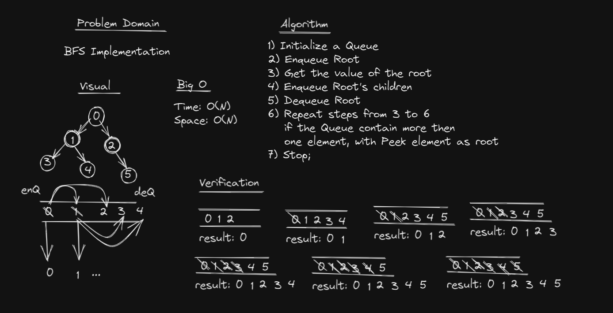
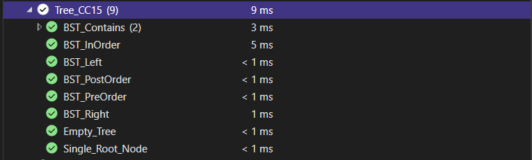

# Trees
Tree is a collection of Nodes linked togother to simulate a non-linear DS.
A Node can have any number of children but one parent.

## Challenge
Implementing:
- Binary Tree
- Binary Search Tree

## Approach & Efficiency
Binary Tree

**DFS:** PreOrder, InOrder, PostOrder
- Time O(N)
- Space O(N)

**BFS:**
- Time: O(N)
- Space: O(N)

Binary Search Tree (Create)
- Time
	- Avarage: O(Logn)
	- Worst: O(N)
- Space: O(1)

## Testing 

