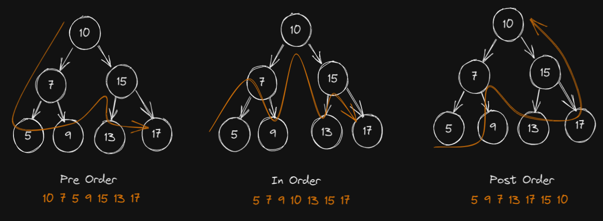
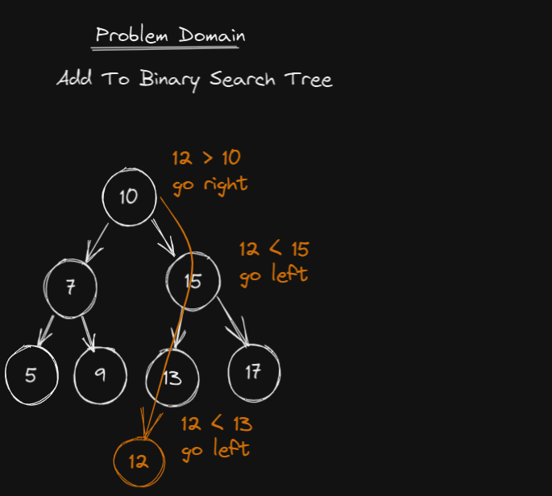
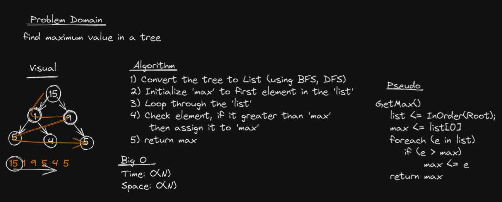
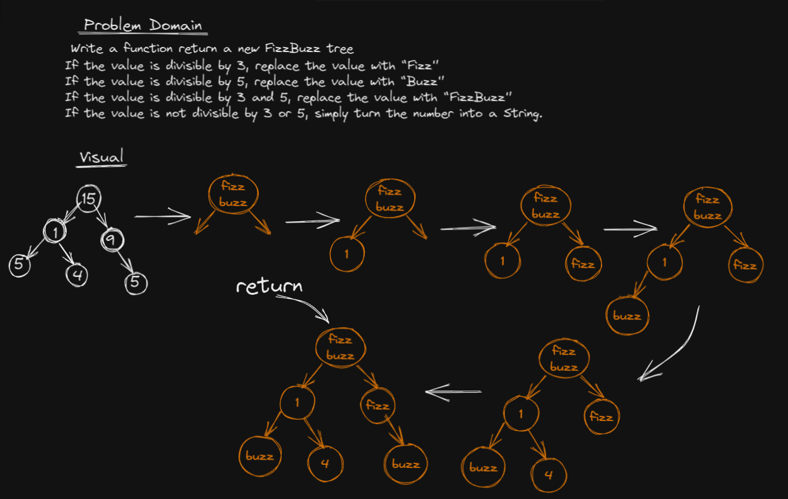

# Trees
Tree is a collection of Nodes linked togother to simulate a non-linear DS.
A Node can have any number of children but one parent.

## Challenge
Implementing:
- Binary Tree
    - Depth-First-Search (PreOrder, InOrder, PostOrder)
	- Breadth-First-Search
	- Get Max
- Binary Search Tree
    - Add
	- Contains
- K-ary Tree
    - Breadth-First-Search
	- FizzBuzz Tree;

## Approach & Efficiency

### **Binary Tree**

**DFS:** PreOrder, InOrder, PostOrder
- Time O(N)
- Space O(1)

**BFS:**
- Time: O(N)
- Space: O(N)

Binary Search Tree (Add)
- Time
	- Avarage: O(Logn)
	- Worst: O(N)
- Space: O(1)

**Get Max**

- Time: O(N)
- Space: O(N)

### K-ary Tree
**Breadth-First-Search**
- Time: O(n)
- Space: O(N)

**FizzBuzz Tree**
- Time: O(n)
- Space: O(n^2)

**Algorithm**
1. Traverse the original tree using BFS algorithm.
2. Initializa a FizzBuzzQ and FizzBizzRoot.
3. When you Enqueue children to the Queue (during BFS), check the fizzbuzz value for the child.
4. Assign it as child for FizzBuzzRoot.
5. Enqueu it to the FizzBuzzQ.
6. Dequeu from FizzBuzzQ as a FizzBuzzRoot,
7. Repeat steps from 3 to 6, while BFS algorithm ends.
7. Stop;

## Testing 

