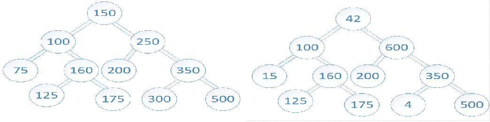

# Challenge Summary
Write a function that takes two binary trees as parameters.

- Input



- Output

[100, 160, 125, 175, 200, 350, 500]


## Approach & Efficiency

1. Add the first tree to a hashtable
2. Traverse the second tree, and check if its item exists in the hashtable


## Solution

```c#
public class TreeIntersection
    {
        public List<int> GetIntersection(BinarySearchTree tree1, BinarySearchTree tree2)
        {
            List<int> intersection = null;

            if (tree1 != null && tree2 != null)
            {
                Hashtable hash = AddTreeToHashtable(tree1);
                intersection = GetIntersection(tree2.Root, hash, new List<int>());
            }

            return intersection;
        }

        public Hashtable AddTreeToHashtable(BinarySearchTree tree)
        {
            Hashtable hash = new Hashtable();
            return GetTreeToHashtable(tree.Root, hash);
        }

        private List<int> GetIntersection(BinaryTreeNode root,
            Hashtable hashtable,
            List<int> intersection)
        {

            if (root != null)
            {
                if (hashtable.ContainsKey(root.Value))
                    intersection.Add(root.Value);

                GetIntersection(root.Left, hashtable, intersection);
                GetIntersection(root.Right, hashtable, intersection);
            }

            return intersection;
        }

        private Hashtable GetTreeToHashtable(BinaryTreeNode root, Hashtable hashtable)
        {
            if (root != null)
            {
                if (!hashtable.ContainsKey(root.Value))
                    hashtable.Add(root.Value, root.Value);

                GetTreeToHashtable(root.Left, hashtable);
                GetTreeToHashtable(root.Right, hashtable);
            }

            return hashtable;
        }
    }
```